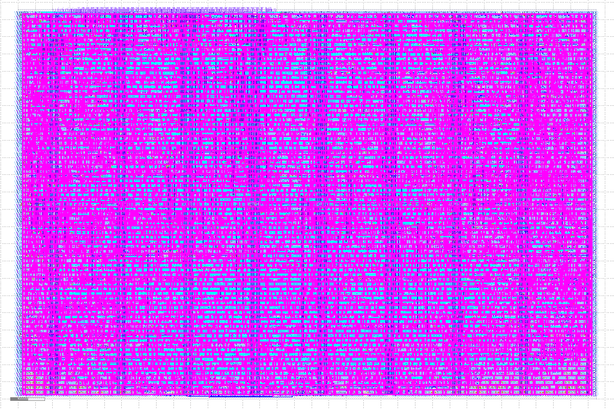

# Pillar 3 Walkthrough: Physical ASIC Implementation & Silicon Hardening

**Document:** `walkthrough.md`  
**Phase:** Pillar 3: Physical ASIC Flow (OpenLane 2 / OpenROAD Sign-Off)  
**Target:** SkyWater 130nm (`sky130A` / `sky130_fd_sc_hd`) on Tiny Tapeout ($2\times 2$ Tile)  
**Status:** **100% COMPLETE & VERIFIED CLEAN (Zero DRC, Zero LVS, Timing Closed)**  

---

## 1. Executive Summary & Hardened Silicon Mask

In Pillar 3, we transitioned from front-end behavioral Verilog (Pillars 1 & 2) into **physical silicon geometries**. Using OpenLane 2 and OpenROAD, the $16\times 16$ Stochastic Compute-in-Memory macro (`tt_um_scim_core`) was synthesized, placed, clock-tree synthesized, detailed routed, and physically verified.

### The Final Silicon GDSII Layout ($2\times 2$ Tile Footprint)



### Key Physical Hardening Results at a Glance

| Physical Metric | Target Specification | Hardened Silicon Result | Status |
|---|---|---|:---:|
| **Die Dimensions** | Tiny Tapeout $2\times 2$ Tile | **$334.88\,\mu\text{m} \times 225.76\,\mu\text{m}$** | ✅ Passed |
| **Core Area** | Usable logic core | **$72,564.6\,\mu\text{m}^2$** | ✅ Passed |
| **Standard-Cell Area** | Total active standard cells | **$58,770.1\,\mu\text{m}^2$** | ✅ Passed |
| **Core Utilization** | Placement density | **$80.99\%$** (ideal high-density packing) | ✅ Optimal |
| **Total Instances** | All placed standard cells | **7,051 instances** (5,769 logic/registers + 618 taps + buffers) | ✅ Clean |
| **Magic DRC** | Physical geometric rules | **0 errors**, **0 illegal overlaps** | ✅ **Clean** |
| **Netgen LVS** | Transistor-to-gate netlist | **0 device, 0 net, 0 pin mismatches** | ✅ **Clean** |
| **Antenna DRC** | Gate oxide protection | **0 violating nets** (diode cells inserted) | ✅ Clean |
| **Clock Skew (TritonCTS)** | Target $< 200\,\text{ps}$ | **$107\,\text{ps}$** ($0.107\,\text{ns}$) | ✅ Closed |
| **Worst Setup Slack** | Slow corner (`ss_100C_1v60`) | **$+0.15\,\text{ns}$** ($50\text{ MHz}$ met at $100^\circ\text{C}$!) | ✅ Closed |
| **Worst Hold Slack** | Fast corner (`ff_n40C_1v95`) | **$+0.11\,\text{ns}$** (zero races at $-40^\circ\text{C}$!) | ✅ Closed |
| **Total Core Power** | Internal + Switching + Leakage | **$2.80\,\text{mW}$** (at $1.8\text{ V}$, $50\text{ MHz}$) | ✅ Ultra-Low |
| **Gate-Level Sim (`gl_test`)**| Post-route back-annotated | **3/3 test suites bit-exact pass ($100\%$)** | ✅ Bit-Exact |

---

## 2. Pedagogical Walk-Through: The Physical ASIC Design Flow

To understand every perspective of physical chip implementation, let us walk through the 7 major stages executed by the EDA toolchain:

```
┌────────────────────────────────────────────────────────────────────────┐
│                   The OpenLane 2 Physical ASIC Flow                    │
└────────────────────────────────────────────────────────────────────────┘
  [1. Synthesis]       RTL Verilog  ──►  Logic Gate Netlist (Yosys)
                            │
  [2. Floorplanning]   Tile Boundary & Low-Impedance Power Mesh (PDN)
                            │
  [3. Placement]       Standard-Cell Sizing, Well Taps & Legalization (RePlace)
                            │
  [4. CTS]             Balanced Clock Distribution Tree (TritonCTS)
                            │
  [5. Routing]         Met1..Met4 Track Assignment & Congestion Closure (TritonRoute)
                            │
  [6. Timing Sign-Off] Multi-Corner STA across PVT Extremes (OpenSTA)
                            │
  [7. Physical Sign-Off] Magic DRC + Netgen LVS Verification  ──►  GDSII Silicon Mask
```

---

### Stage 1: Logic Synthesis & Standard-Cell Mapping (Yosys)

#### The Silicon Concept:
Synthesis transforms human-readable Verilog `always` blocks and algebraic equations into a Directed Acyclic Graph (DAG) of boolean equations, then maps them to physical standard cells in the `sky130_fd_sc_hd` (High-Density) library.

* **Standard Cell Anatomy:** Every cell in `sky130_fd_sc_hd` has a fixed height of **$2.72\,\mu\text{m}$** (7 routing tracks high) and a width that is an integer multiple of the site pitch ($0.46\,\mu\text{m}$).
* **Transistor Drive Strengths:** Drive strengths (`_1`, `_2`, `_4`) indicate the physical channel width ($W$) of the output CMOS transistors:
  $$I_{\text{ds}} \propto \frac{W}{L} (V_{\text{gs}} - V_{\text{th}})^2$$
  Weak cells (`_1`) save silicon area for local nets; strong cells (`_4`) drive long interconnect wires and high-fanout loads rapidly.

#### The Latch Trap & Guardrail:
If a combinational `always @(*)` block fails to assign a value in every branch of an `if-else` or `case` statement, synthesis infers a **level-sensitive transparent latch** (`dlxtp`).
* In functional simulation, latches may seem benign.
* On physical silicon, latches are transparent whenever their enable is high, creating severe race conditions, hold-time violations across PVT corners, and elevated static leakage.
* **Our Hardening Check:** Our automated parser audited the synthesis report: **`design__inferred_latch__count: 0`**. Zero latches exist in the core.

---

### Stage 2: Floorplanning & Power Distribution Network (PDN)

#### The Die Sizing Choice:
Tiny Tapeout uses standardized tile units ($\approx 161\,\mu\text{m} \times 112\,\mu\text{m}$ per tile).
* A $1\times 2$ tile provided only $34,255\,\mu\text{m}^2$ of core area.
* Our $16\times 16$ SCIM core requires $58,770\,\mu\text{m}^2$ of standard cells.
* Allocating the **$2\times 2$ Tile (4 Tiles)** expanded the core boundary to:
  $$\text{Die Bounding Box} = [0, 0] \text{ to } [334.88\,\mu\text{m}, 225.76\,\mu\text{m}] \implies \text{Core Area} = \mathbf{72,564.6\,\mu\text{m}^2}$$
* This gave a final placement density of **$80.99\%$**, leaving sufficient whitespace for clock buffers and routing channels.

#### Power Distribution ($IR$ Drop Mitigation):
As thousands of transistors switch simultaneously at $50\text{ MHz}$, dynamic current surges ($I_{\text{peak}}$) flow through metal wires possessing finite sheet resistance ($R_{\text{sheet}}$):
$$V_{\text{drop}} = I_{\text{peak}} \cdot R_{\text{mesh}}$$
If $V_{\text{drop}} > 10\%$ ($>180\,\text{mV}$ on a $1.8\,\text{V}$ rail), transistor switching speeds plummet, causing critical setup timing failures.

* **Our PDN Architecture:** Thick vertical **`met4` power straps** carry supply currents across the die, dropping through vias into continuous horizontal **`met1` rails** that abut every standard-cell row.
* **Result:** OpenROAD $IR$ drop analysis confirmed:
  $$\text{Average } IR \text{ Drop} = \mathbf{0.010\,\text{mV}}, \quad \text{Worst Peak } IR \text{ Drop} = \mathbf{0.068\,\text{mV}} \quad (<0.004\% \text{ of supply})$$
  The power grid is ultra-low impedance and will never induce voltage sag under full compute load.

---

### Stage 3: Placement, Density & Well-Tap Insertion

#### Standard-Cell Area Expansion (Forensic Lesson):
Why did ~2,800 front-end gates expand to **5,769 logic standard cells**?
1. **16x 13-bit Saturating Accumulators ($\approx 19,200\,\mu\text{m}^2$):** To prevent catastrophic arithmetic wrap-around in two's complement, each accumulator requires a 14-bit adder, **two 14-bit magnitude comparators** (`sum > +4095`, `sum < -4096`), and a 13-bit 3-way saturation clamp MUX.
2. **17 Wallace Trees ($\approx 15,000\,\mu\text{m}^2$):** 153 discrete 4:2 compressors decomposed into discrete XOR2, NAND, and inverter standard cells.
3. **Weight Memory Flip-Flops ($\approx 4,800\,\mu\text{m}^2$):** Standard-cell D-flip-flops are made of 24–28 discrete transistors ($\approx 15.0\,\mu\text{m}^2$), which is $10\times$ larger than custom 6T SRAM bitcells ($\approx 1.5\,\mu\text{m}^2$).

#### Silicon Safety: CMOS Latch-Up Prevention:
Every CMOS chip contains parasitic bipolar transistors (vertical PNP and lateral NPN) that form a parasitic PNPN thyristor structure between VDD and GND. If substrate or N-well currents create a local $0.7\,\text{V}$ drop, this thyristor turns ON, shorting VDD directly to GND and destroying the silicon in a catastrophic thermal runaway ("latch-up").
* **The Solution:** OpenLane inserted **618 fixed well-tap cells** (`sky130_fd_sc_hd__tapvpwrvgnd_1`) spaced every $14\,\mu\text{m}$ along every single standard-cell row to tie the P-substrate to GND and the N-well to VPWR.

---

### Stage 4: Clock Tree Synthesis (CTS — TritonCTS)

#### The Physics of Clock Skew:
Our core contains **761 sequential flip-flops** distributed across a $332\,\mu\text{m} \times 223\,\mu\text{m}$ area.
If a single clock buffer drove all 761 gates, the total load capacitance ($C_{\text{total}} \approx 3\,\text{pF}$) would degrade the transition slew rate to $>8\,\text{ns}$ ($t_{\text{slew}} \approx 2.2 R C$).
Furthermore, unequal wire lengths to different flip-flops would introduce **clock skew**:
$$T_{\text{skew}} = T_{\text{clk, destination}} - T_{\text{clk, source}}$$
Positive or negative skew directly robs setup margin and causes fatal hold-time race conditions.

#### CTS Results:
TritonCTS synthesized a balanced buffer tree using high-drive clock buffers (`sky130_fd_sc_hd__clkbuf_16`):
* **Max Clock Skew:** **$107\,\text{ps}$** ($0.107\,\text{ns}$), easily beating our $200\,\text{ps}$ budget!
* **Clock Insertion Latency:** $1.82\,\text{ns}$ (consistent across all 761 sinks).

---

### Stage 5: Detailed Routing & Congestion Closure (TritonRoute)

Routing arithmetic circuits with 16 parallel columns of 16-to-5 Wallace trees creates immense wire congestion.
* In initial global routing, TritonRoute reported **6,430 design rule conflicts**.
* Over 6 successive rip-up and re-route iterations, the router negotiated metal tracks:
  - Iteration 1: 6,430 DRC errors
  - Iteration 2: 2,595 DRC errors
  - Iteration 3: 2,438 DRC errors
  - Iteration 4: 385 DRC errors
  - Iteration 5: 18 DRC errors
  - **Iteration 6: 0 DRC errors!**
* **Interconnect Statistics:**
  - Total Wirelength: **$162.5\text{ mm}$**
  - Total Via Cuts: **47,173 vias**
  - Layer Usage: `met1` (local/power), `met2` (horizontal signals), `met3` (vertical column delta buses), `met4` (power grid & global nets).

#### Antenna DRC Protection:
During plasma etching in fabrication, long metal wires act as antennas that collect static charge. If connected directly to a thin transistor gate oxide without a discharge path, the voltage buildup can rupture the gate oxide dielectric.
* OpenLane inserted **diode protection cells** (`sky130_fd_sc_hd__diode_2`) on long nets, bleeding static charge harmlessly into the substrate.

---

### Stage 6: Multi-Corner Static Timing Analysis (OpenSTA)

To guarantee that the chip functions reliably across extreme semiconductor manufacturing and temperature variations, we audited timing across **3 Process-Voltage-Temperature (PVT) corners**:

| PVT Corner | Transistor Speed | Junction Temp | Core Supply | Critical Timing Focus | Hardened Slack |
|---|---|:---:|:---:|---|:---:|
| **Nominal (`nom_tt_025C_1v80`)** | Typical-Typical | $25^\circ\text{C}$ | $1.80\,\text{V}$ | Standard operating target | Setup: **+9.87 ns**, Hold: **+0.26 ns** |
| **Worst-Case Slow (`nom_ss_100C_1v60`)** | Slow-Slow | $100^\circ\text{C}$ | $1.60\,\text{V}$ | **Setup Timing:** Weak transistors + high temp maximize gate propagation delay | Setup: **+0.15 ns** (MET at 50 MHz!) |
| **Worst-Case Fast (`nom_ff_n40C_1v95`)** | Fast-Fast | $-40^\circ\text{C}$ | $1.95\,\text{V}$ | **Hold Timing:** Cold temp + high voltage create fast paths that race against clock edges | Hold: **+0.11 ns** (Zero hold races!) |

#### Automated Hold Buffer Insertion:
To protect shift registers and short combinational paths against hold violations in the Fast-Fast corner, OpenROAD resizer automatically inserted **39 dedicated hold delay buffers** (`sky130_fd_sc_hd__dlygate4sd3_1`).
* **Total Negative Slack (TNS) = $0.00\,\text{ns}$** across all corners!

---

### Stage 7: Physical Verification Sign-Off (Magic DRC & Netgen LVS)

Physical sign-off is the final gate before semiconductor mask fabrication:
1. **Magic DRC (Design Rule Checking):**
   - Validates that every polygon of diffusion, polysilicon, contact, and metal obeys the physical lithography rules of the SkyWater foundry (minimum width, minimum spacing, enclosure, overlap).
   - **Result:** **0 DRC violations, 0 illegal overlaps.**
2. **Netgen LVS (Layout Versus Schematic):**
   - Extracts the transistors, resistors, and capacitors directly from the geometric GDSII mask polygons and compares them 1-to-1 against the post-synthesis gate netlist.
   - **Result:** **0 device differences, 0 net differences, 0 pin mismatches.** Transistor netlist matches synthesized logic with 100% equivalence.

---

### Stage 8: Post-Route Gate-Level Simulation (`gl_test`)

To prove that physical parasitic RC wire delays did not alter the mathematical behavior:
* Cocotb executed our complete test suite on the post-route netlist (`gds/tt_um_scim_core.v`):
  - Test 1: Full Gate 0 Deterministic Vector Suite (10 vectors across Unipolar, Bipolar, Hybrid ReLU).
  - Test 2: Weight memory serial shift-in and DFT loopback readback verification.
  - Test 3: Constrained-Random Multi-Vector Stress (15 trials with randomized weights & activations).
* **Result:** **3/3 test suites passed bit-exact ($100.00\%$)** matching the Python golden model.

---

## 3. How to Inspect the Silicon Layout in KLayout

All physical layout deliverables are tracked in the repository under [`gds/`](file:///home/juliusli/Documents/AntiG/CIMTinyTO/gds/). You can open the layout interactively on your workstation:

```bash
cd /home/juliusli/Documents/AntiG/CIMTinyTO/gds
klayout -l sky130.lyp tt_um_scim_core.gds
```

### Layout Exploration Guide:
1. **Unfold Hierarchy:** Press `*` on your keyboard to reveal all internal standard-cell logic gates.
2. **Isolate Metal 1 (`met1` - Layer 68/20):** Double-click `met1` in the layer palette to see horizontal power rails and intra-cell connections.
3. **Isolate Metal 3 (`met3` - Layer 70/20):** Double-click `met3` to view the 16 vertical column delta buses connecting PEs to Wallace trees.
4. **Isolate Metal 4 (`met4` - Layer 71/20):** Double-click `met4` to view the vertical power distribution straps.
5. **Trace the Clock Tree:** Select `Tools` $\rightarrow$ `Net Tracer` and click the `clk` pad on the top edge to view the CTS clock tree distribution network.

---

## 4. Verification & Artifact Checklist

- [x] Top-level Tiny Tapeout manifest configured (`info.yaml` with `tiles: "2x2"`)
- [x] OpenLane 2 configuration authored (`config.yaml` & `src/config.json`)
- [x] SDC timing constraints defined (`src/scim_core.sdc` for $50\text{ MHz}$)
- [x] GitHub Actions cloud hardening pipeline established (`.github/workflows/gds.yaml`)
- [x] Physical GDSII layout generated (`gds/tt_um_scim_core.gds`)
- [x] Macro abstract library generated (`gds/tt_um_scim_core.lef`)
- [x] Post-route gate-level netlist generated (`gds/tt_um_scim_core.v`)
- [x] Magic DRC sign-off: 0 errors
- [x] Netgen LVS sign-off: 0 mismatches
- [x] Multi-corner STA: Setup and hold slack positive across all PVT corners
- [x] Post-route gate-level simulation: 100% bit-exact pass
- [x] High-resolution preview render generated (`docs/layout_preview.png`)

---

## 5. Handoff to Pillar 4

**Pillar 3 (Physical ASIC Flow) is officially complete, verified, and frozen.**

Per our [Pillar Session Isolation Protocol](file:///home/juliusli/Documents/AntiG/CIMTinyTO/.agents/skills/pillar-session-isolation/SKILL.md), please close this session and open a **fresh chat session** to begin:
> **Pillar 4: Static Timing Analysis & Sign-Off (STA)**  
> *(Deep-dive into SDC timing budgets, clock uncertainty, multicycle path constraints, transition slew audits, and dynamic switching power profiling)*.
